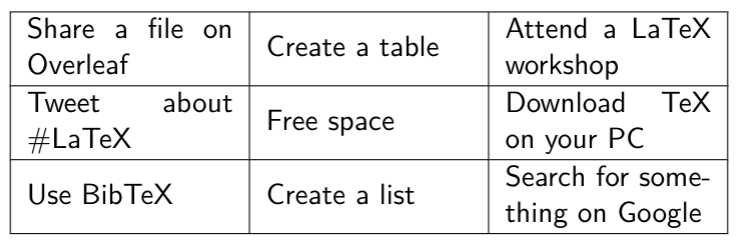

# Challenges

During the workshop, group activities will be run using Breakout rooms in Zoom. These are referred to as challenges.

##  2.1 Getting started

* [ ] Introduce yourselves.
* [ ] Come up with a team name!
* [ ] Select one member of your team to create an [Overleaf](www.overleaf.com) document and share this with the group by pasting the edit link in the chat.
* [ ] Set your team name as the `\author{ }`.


Hint: If you're having trouble navigating Overleaf, please refer to our visual cheat sheet: [Overleaf layout diagram](../../resources/downloads/cheat.md).



Bonus challenge: If you finish early, start reading through the documentation on [Environments](../../module-1/environments/), [Lists](../lists/) and [Tables](../tables/).


##  2.2 Lists

* [ ] Create a list of things which can happen during a video call using the `itemize` environment.
* [ ] Create a shopping list of items you would like to buy to make a dish. Use the `enumerate` environment to order the items on your list.


Bonus challenges: 

* [ ] Add a nested list to one of your lists \(how many levels deep can you go?\)
* [ ] Change the symbol of one of the items in your unordered list to an asterisk \(\*\).


## 2.3 Bingo

* [ ] In your document, create a 3x3 bingo table for video calls.
* [ ] When you return, share a \(read only\) link to your Overleaf document in the group chat.
* [ ] Choose one member of your team to present your Overleaf document \(via screen share\) when you return.








Overleaf has a comprehensive guide on tables.   
In particular, you may find the following useful:   
[https://www.overleaf.com/learn/latex/tables\#Reference\_guide](https://www.overleaf.com/learn/latex/tables#Reference_guide)





So you want to **specify the width** of your table's **columns**?  
We've seen left`l`, centre`c` and right`r` aligned columns. Another type of column alignment is **paragraph**, which will allow line wrapping. This is achieved using `p{ }`.   
Remember that `{ }` indicates a required argument --- what could this be?




```text
% p{1in} can be used to specify a column of width 1 inch
% The following code was used to produce the Example bingo table
% This table has columns of width 3cm.

\begin{tabular}{|p{3cm}|p{3cm}|p{3cm}|}
    \hline
    Share a file on Overleaf & Create a table & Attend a LaTeX workshop \\
    \hline
    Tweet about \#LaTeX      & Free space     & Download TeX on your PC \\
    \hline
    Use BibTeX               & Create a list  & Search for something on Google \\
    \hline
\end{tabular}
```




Bonus challenges:

* [ ] Figure out how you can set the width of your table's columns \(you may need to Google this one!\) --- refer to the hints above if you need help.
* [ ] If you have extra time, expand your table to be 4x4. You can also find inspiration online by searching for bingo tables.
* [ ] Create a 'free space' and shade this cell in a different colour. You will need to use the `xcolor` package: `\usepackage[table]{xcolor}`.


