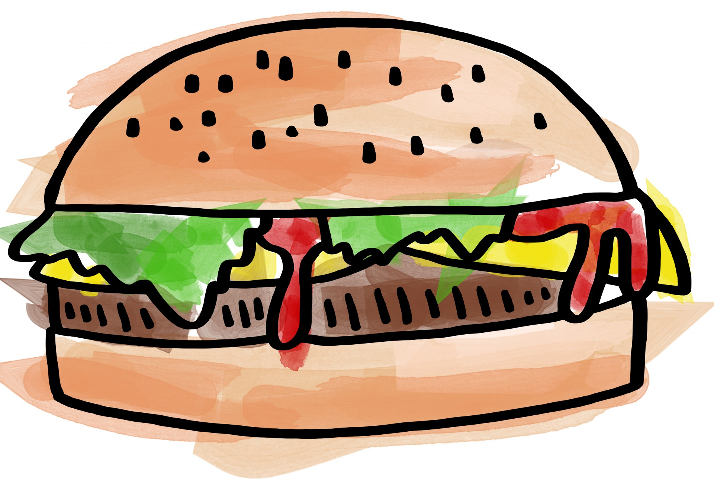

# Environments

LaTeX is a block structure language. This means that information appears in blocks:

```text
\begin{document}
    contents...
\end{document}
```

Here, `\begin` signals the start of the block and `\end` \(...you guessed it!\) signals the end of the block.

These blocks are referred to \(in LaTeX jargon\) as _environments_. However, I like to think of them as burgers. Here's why:



Burgers are two buns \(pieces of bread\), with some filling in the middle. Environments in LaTeX have the same structure. `\begin` and `\end` are our buns and all the information/contents of the environment are the ingredients of our burger, and go in the middle. Anything outside the buns \(before `\begin` or after `\end`\) is not part of the environment. Similarly, we cannot have a burger with if one of the buns is missing \(LaTeX will give us an error\).


Every `\begin{ }` command must have a matching `\end{ }` command.


