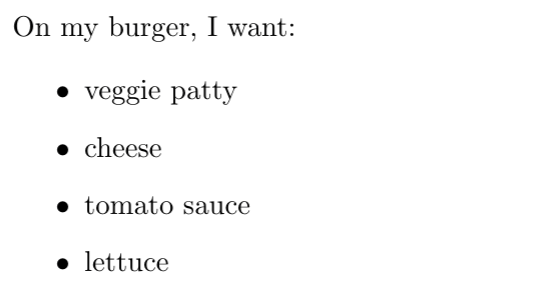

# Lists

Lists can be created in LaTeX using an `itemize` [environment](../../module-1/environments.md):

```text
On my burger, I want:

\begin{itemize}
    \item veggie patty
    \item cheese
    \item tomato sauce
    \item lettuce
\end{itemize}
```

The command `\item` is used to signal each item \(or bullet point\) on our list.




Notice that American English is used for the spelling of LaTeX commands.


This is known as an _unordered_ list, because the bullet points have no inherent order. Alternatively, you can also create an _ordered_ list.

## Ordered lists

Ordered lists can be created in LaTeX using an `enumerate` environment:

```text
Four things I want on my burger:

\begin{enumerate}
    \item veggie patty
    \item cheese
    \item tomato sauce
    \item lettuce
\end{enumerate}
```

As with the `itemize` environment, the command `\item` is used to signal each item  on our list.


Notice how each of the items in our list is automatically assigned a number. This can be useful if you are writing/answering assignment questions, want to give a preference/hierarchy ordering to the items on your list, and/or if you later want to refer to particular items on the list.

