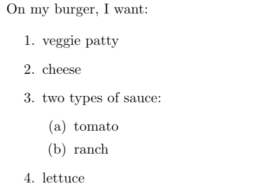

# Nesting

You can also nest one list inside another.

Here is an example:

```text
On my burger, I want:

\begin{enumerate}
    \item veggie patty
    \item cheese
    \item two types of sauce:
    \begin{enumerate}
        \item tomato
        \item ranch
    \end{enumerate}
    \item lettuce
\end{enumerate}
```




Unlike other languages such as Python, tabs \(and extra whitespace\) in LaTeX are not necessary and do not carry any special meaning. In the above example, I used tabs to indent the items and make it easier to differentiate the nested list.


