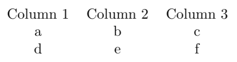
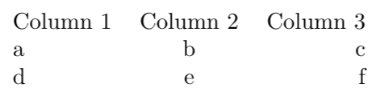
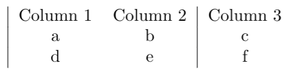

# Tables

Tables are another type of environment which is frequently used in LaTeX documents.

```text
\begin{tabular}{ccc}
    Column 1 & Column 2 & Column 3 \\
        a    &     b    &     c    \\
        d    &     e    &     f    \\
\end{tabular}
```



### Rows

Let's start by talking about the contents of the tabular environment: lines 2 to 4. Each of these lines represents a row in our table. The line ends with a double backslash: `\\`, which is also known as a line break and signals the end of the row.

Ampersand: `&`  is the alignment character and shows LaTeX where to align each column accross multiple rows.

### Columns

Next, let's consider the curly brackets after `\begin{tabular}` in line 1: `{ccc}` . These give the number and alignment of the columns. It is natural to think that the `c` stands for column; however this actually stands for **centre**. In the example, we have three columns which are centre aligned: `{ccc}`.

Columns may also be left or right aligned:

```text
\begin{tabular}{lcr}
    Column 1 & Column 2 & Column 3 \\
        a    &     b    &     c    \\
        d    &     e    &     f    \\
\end{tabular}
```



Here, `{lcr}` gives us three columns: 

* a left justified column \(`l`\),
* a centred column \(`c`\), 
* and a right justified column \(`r`\).

## Adding borders

You can choose where you want to add vertical or horizontal lines to your table.

### Vertical lines

Vertical lines can easily be added to your table where the columns are specified. We do this using the vertical bar character: `|` \(you can find this on the same key as the backslash: `\` on your keyboard by holding down Shift\).

In the following example, vertical lines were added before column 1 and between columns 2 and 3:

```text
\begin{tabular}{ | c c | c }
    Column 1 & Column 2 & Column 3 \\
        a    &     b    &     c    \\
        d    &     e    &     f    \\
\end{tabular}
```



### Horizontal lines

Horizontal lines can be added between rows of your table using the command `\hline`.

In the following example, horizontal lines were added before and after the first row, and at the end of the table:

```text
\begin{tabular}{ | c c | c | }
    \hline
    Column 1 & Column 2 & Column 3 \\
    \hline
        a    &     b    &     c    \\
        d    &     e    &     f    \\
    \hline
\end{tabular}
```

