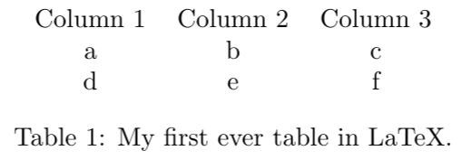
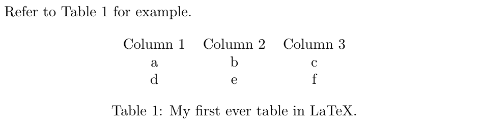

# Table vs tabular

So far, we have seen only the `tabular` environment. The `tablular` environment can go inside a `table` environment:

```text
\begin{table}[h]
    \centering
    \begin{tabular}{ccc}
        Column 1 & Column 2 & Column 3 \\
            a    &     b    &     c    \\
            d    &     e    &     f    \\
    \end{tabular}
    \caption{My first ever table in LaTeX.}
    \label{mytable}
\end{table}
```



Let's examine this line-by-line:

1. `\begin{table}` is the first bun in our burger, which starts out table environment. The square brackets allow us to add an optional piece of information. In this case, the optional information is the position of the table environment on the page, and `h` attempts to place the table 'here' relative to the surrounding text.
2. `centering` centers the table horizontally on the page.
3. `\begin{tabular}`is the start of the table structure. `{ c c }` gives the number and alignment of the columns. In the example, we have two columns which are centre aligned: `c`, and a vertical line between them: `|`.
4. This is the contents of the first row of our table. Ampersand, `&` , is the alignment character and shows LaTeX where to align each column accross multiple rows. The line ends with a double backslash: `\\`, which is also known as a line break and signals the end of the row.
5. A second row of our table, where `&` is positioned between columns 1 and 2.
6. The third and final row of our table.
7. `\end{tabular}`is the end of the table structure.
8. `\caption{ }` allows us to add a title or caption to our table.
9. `\label{ }` allows us to refer to the table in our document, without worrying about where the table is nor what its reference number is.
10. `\end{table}` is the end of the table and caption.

### Positioning

The square brackets after `\begin{table}` allow us to add an optional piece of information. In this case, the optional information is the position of the table environment on the page. Possible positioning options include: 

* `h`: position the table 'here' relative to the surrounding text.
* `t`: position the table at the top of the page.
* `b`: position the table at the bottom of the page.
* `p`: position the table on its own page \(possibly with other tables\).


These are requests to override the automatic positioning determined by LaTeX, and cannot always be implemented. For example, you may request to place a large table `h`, but 'here' is at the bottom of the page, and there is not enough room --- in this case, LaTeX will automatically choose the next best position for you, which may be at the top of that page, or on the following page.

For this reason, I recommend you do not use locational references \(e.g. "refer to the table below"\). Instead, you can refer to a table using the label.


### Caption

A caption can be added to the `table` environment using the command `\caption{ }`. This caption can appear before \(above\) or after \(below\) the `tabular` environment.

This caption will follow your table, where ever it goes, so you don't need to worry about the positioning of your table.

### Label

The `\label{ }` is used to refer to your table within the document. This label can be anything you want, as the text will not appear in the PDF output. 

When you want to refer to the table, you can use the command `\autoref{mytable}`, where `mytable` is the specific label you assigned to that table. You will also need to add the hyperref package to your preamble.

```text
Refer to Table \ref{mytable} for example.

\begin{table}[h]
    \centering
    \begin{tabular}{ccc}
        Column 1 & Column 2 & Column 3 \\
            a    &     b    &     c    \\
            d    &     e    &     f    \\
    \end{tabular}
    \caption{My first ever table in LaTeX.}
    \label{mytable}
\end{table}
```



Using labels to refer to a table means you do not need to worry about the position of the table, and LaTeX will assign and keep track of the table number.

